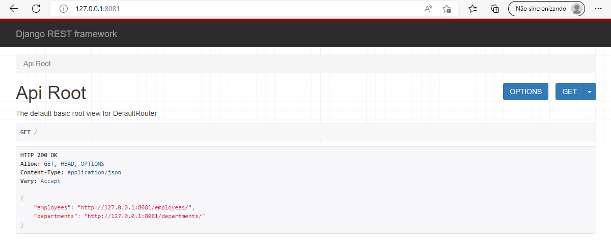
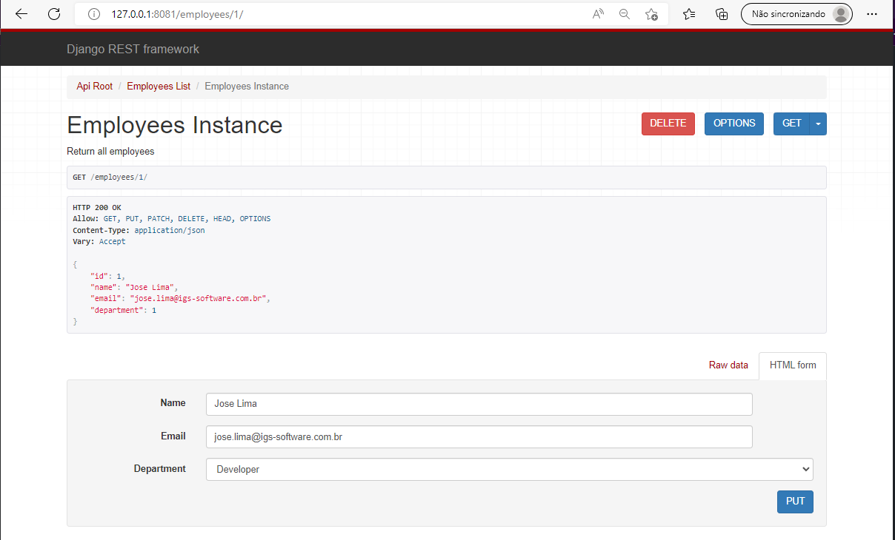
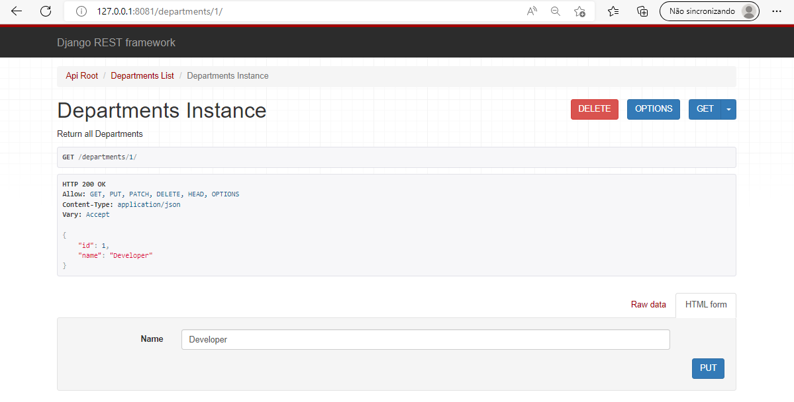
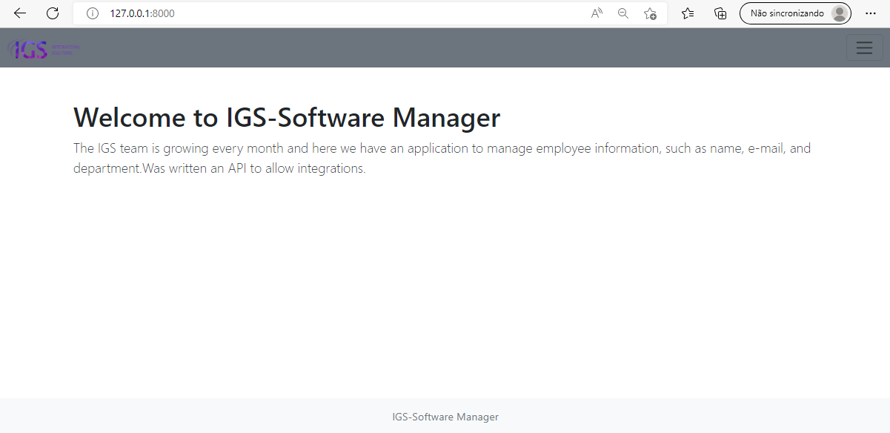
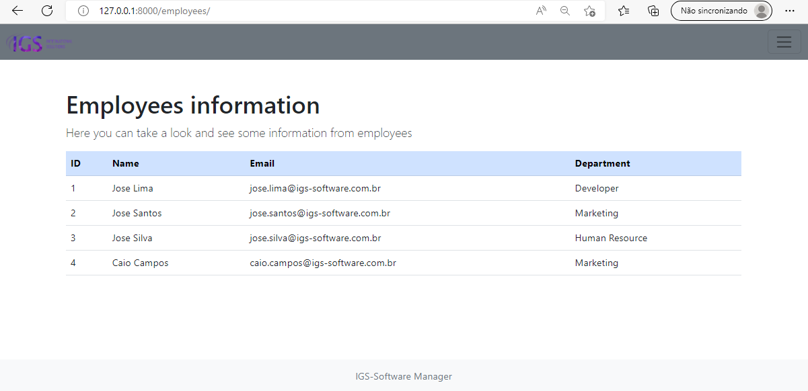
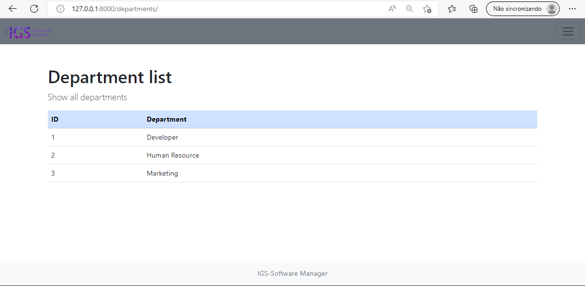

# IGS-Software-Manager

This project was written in Django and REST Framework.

It have an API and a Website to visualize the data.

## The problem

The IGS team is growing every month and now we need to have some applications to 
manage employee information, such as name, e-mail, and department. As is the case with 
all applications written at IGS, it must have an API to allow integrations


## First Things First

1) Create virtual environment
```
python -m venv venv
```
2) Install all dependencies
```
pip install -r requirements.txt
```

## Run the API

Make sure you don't need to migrate anything first
```
cd api
py manage.py makemigrations
py manage.py migrate
```

You can create super user if you want
```
py manage.py createsuperuser
```

Now run the API
```
py manage.py runserver 8081
```
API url's [http://127.0.0.1:8081/](http://127.0.0.1:8081/)



Employee by id [http://127.0.0.1:8081/employees/id/](http://127.0.0.1:8081/employees/1/)



Department by id [http://127.0.0.1:8081/departments/1/](http://127.0.0.1:8081/departments/1/)



## Run the website
```
cd ags_site
py manage.py runserver
```

Open [http://127.0.0.1:8000/](http://127.0.0.1:8000/) to see the Home Page.




List all employees [http://127.0.0.1:8000/employees/](http://127.0.0.1:8000/employees/)




List all departments [http://127.0.0.1:8000/departments/](http://127.0.0.1:8000/departments/)



